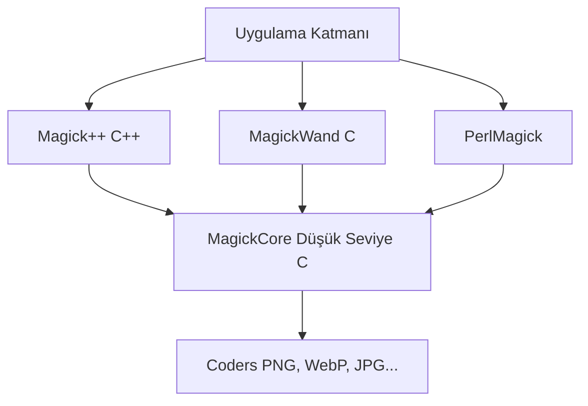
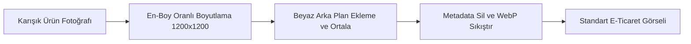
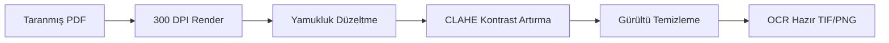

# ImageMagick Kapsamlı Kullanım, Özellik ve Senaryo Kılavuzu

Bu kılavuz, ImageMagick projesinin tüm özelliklerini, komut satırı araçlarını, API katmanlarını, güvenlik politikalarını ve gelişmiş otomasyon senaryolarını içeren eksiksiz bir teknik başvuru rehberidir.

---

## İçindekiler

1. [Giriş ve Proje Mimarisi](#1-giriş-ve-proje-mimarisi)
2. [Temel CLI Kullanımı ve Alt Araçlar](#2-temel-cli-kullanımı-ve-alt-araçlar)
   - [magick](#magick)
   - [identify](#identify)
   - [mogrify](#mogrify)
   - [montage](#montage)
   - [compare](#compare)
   - [composite](#composite)
   - [display, animate ve import](#display-animate-ve-import)
   - [stream](#stream)
   - [conjure ve magick-script](#conjure-ve-magick-script)
3. [Kapsamlı Özellik Grupları ve Terminal Örnekleri](#3-kapsamlı-özellik-grupları-ve-terminal-örnekleri)
   - [Format Dönüştürme](#format-dönüştürme)
   - [Yeniden Boyutlandırma ve Thumbnailing](#yeniden-boyutlandırma-ve-thumbnailing)
   - [Kırpma, Tuval ve Geometri Ayarları](#kırpma-tuval-ve-geometri-ayarları)
   - [Döndürme, Aynalama ve Perspektif Bükme](#döndürme-aynalama-ve-perspektif-bükme)
   - [Renk Alanı, Ton ve Filtre Yönetimi](#renk-alanı-ton-ve-filtre-yönetimi)
   - [Şeffaflık ve Alfa Kanal İşlemleri](#şeffaflık-ve-alfa-kanal-işlemleri)
   - [Bulanıklaştırma, Keskinleştirme ve Sanatsal Efektler](#bulanıklaştırma-keskinleştirme-ve-sanatsal-efektler)
   - [Gürültü Azaltma ve Piksel Filtreleme](#gürültü-azaltma-ve-piksel-filtreleme)
   - [Kenar Algılama ve Özellik Analizi](#kenar-algılama-ve-özellik-analizi)
   - [Histogram ve Kontrast Yayma](#histogram-ve-kontrast-yayma)
   - [Metin Annotasyonları ve Vektör Çizim](#metin-annotasyonları-ve-vektör-çizim)
   - [Katman Birleştirme ve Maskeleme](#katman-birleştirme-ve-maskeleme)
   - [Animasyon ve GIF Optimizasyonu](#animasyon-ve-gif-optimizasyonu)
   - [PDF, SVG ve Vektör İşleme](#pdf-svg-ve-vektör-işleme)
   - [Profil, Renk Yönetimi ve Metadata Temizliği](#profil-renk-yönetimi-ve-metadata-temizliği)
   - [Görsel Şifreleme ve Deşifreleme](#görsel-şifreleme-ve-deşifreleme)
   - [Matematiksel Piksel Operasyonları (FX)](#matematiksel-piksel-operasyonları-fx)
   - [Fourier Dönüşümü, Morfoloji ve Konvolüsyon](#fourier-dönüşümü-morfoloji-ve-konvolüsyon)
   - [Programatik ve Yapay Görsel Üretimi](#programatik-ve-yapay-görsel-üretimi)
   - [Performans, Kaynak Sınırları ve Benchmarking](#performans-kaynak-sınırları-ve-benchmarking)
4. [Desteklenen Varyasyonlar ve Derleme Seçenekleri](#4-desteklenen-varyasyonlar-ve-derleme-seçenekleri)
   - [Format Aileleri](#format-aileleri)
   - [Derleme Parametreleri](#derleme-parametreleri)
   - [Kaynak Kodundan Derleme ve Kurulum](#kaynak-kodundan-derleme-ve-kurulum)
   - [Derleme Sorunları ve Çözümleri](#derleme-sorunları-ve-çözümleri)
   - [CLI İş Akışı Varyasyonları](#cli-iş-akışı-varyasyonları)
5. [Geliştirici API Katmanları ve Dil Entegrasyonları](#5-geliştirici-api-katmanları-ve-dil-entegrasyonları)
   - [MagickCore](#magickcore)
   - [MagickWand](#magickwand)
   - [Magick++](#magick)
   - [PerlMagick](#perlmagick)
   - [Diğer Dil Bağlantıları](#diğer-dil-bağlantıları)
6. [Güvenlik Mimarisi ve Policy Yönetimi](#6-güvenlik-mimarisi-ve-policy-yönetimi)
7. [Test ve Doğrulama Altyapısı](#7-test-ve-doğrulama-altyapısı)
8. [Uygulamalı Senaryolar ve Gelişmiş Entegrasyon Sistemleri](#8-uygulamalı-senaryolar-ve-gelişmiş-entegrasyon-sistemleri)
   - [1. E-Ticaret Ürün Görseli Standartlaştırma Pipeline'ı](#1-e-ticaret-ürün-görseli-standartlaştırma-pipelineı)
   - [2. Web Siteleri İçin Otomatik Görsel Optimizasyon Sistemi](#2-web-siteleri-için-otomatik-görsel-optimizasyon-sistemi)
   - [3. PDF Belge Dijitalleştirme ve OCR Hazırlığı](#3-pdf-belge-dijitalleştirme-ve-ocr-hazırlığı)
   - [4. Sosyal Medya ve Video Thumbnail Otomasyonu (FFmpeg Ortaklığı)](#4-sosyal-medya-ve-video-thumbnail-otomasyonu-ffmpeg-ortaklığı)
   - [5. Görsel Karşılaştırma ve Hata Raporlama Sunucusu](#5-görsel-karşılaştırma-ve-hata-raporlama-sunucusu)
   - [Ekosistem Araçları ve Entegrasyon Matrisi](#ekosistem-araçları-ve-entegrasyon-matrisi)

---

## 1. Giriş ve Proje Mimarisi

ImageMagick; raster ve vektör görsellerin oluşturulması, düzenlenmesi, dönüştürülmesi ve analizi için geliştirilmiş, son derece güçlü bir açık kaynaklı yazılım paketidir. Sistem mimarisi, düşük seviyeli piksel manipülasyonundan yüksek seviyeli komut satırı otomasyonuna kadar uzanan katmanlı bir yapıdan oluşur.

### Kaynak Ağacı Yapısı
Projenin kaynak kod dizinleri şu işlevsel alanlara bölünmüştür:
*   `MagickCore/`: Piksel önbelleği (pixel cache), dosya girdi/çıktı, renk yönetimi ve en temel görüntü işleme algoritmalarını barındıran düşük seviyeli C kütüphanesi.
*   `MagickWand/`: Komut satırı araçlarının ve üst seviye uygulamaların kullandığı, C dilinde geliştirilmiş basitleştirilmiş bir API katmanı.
*   `Magick++/`: C++ standart kütüphanesini ve nesne yönelimli paradigmayı kullanan modern C++ arayüzü.
*   `PerlMagick/`: Perl betikleri içinden ImageMagick işlevlerine erişim sağlayan entegrasyon modülü.
*   `coders/`: PNG, JPEG, TIFF, PDF, SVG, WebP, HEIC ve raw piksel gibi yüzlerce farklı formatın okunup yazılmasını sağlayan bağımsız format modülleri (coders).
*   `utilities/`: Komut satırı araçlarının dokümantasyonunu ve giriş noktalarını içeren dizin.
*   `config/`: Sistem kaynak limitleri, güvenlik politikaları, yazı tipleri, loglama ve MIME tiplerini yapılandıran XML dosyaları.
*   `api_examples/`: CLI, MagickWand ve komut işlemcilerinin kullanımına dair pratik C ve kabuk betiği örnekleri.

---

## 2. Temel CLI Kullanımı ve Alt Araçlar

ImageMagick 7 sürümüyle birlikte tüm alt araçlar, ana `magick` komutunun altında birer argüman veya alt işlemci olarak konsolide edilmiştir. Bu durum komutların soldan sağa doğru tutarlı ve doğrusal şekilde işlenmesini sağlar.

### `magick`
Format dönüştürme, efekt uygulama ve piksel manipülasyonu gibi neredeyse tüm temel görüntü işleme işlemlerini yürüten ana komuttur.
```bash
magick input.jpg -resize 800x600 -quality 85 output.png
```
*   **İşlev:** Görseli okur, belleğe alır, parametreleri uygular ve PNG olarak yazar.

### `identify`
Görsellerin boyut, renk uzayı, piksel formatı, çözünürlük ve metadata bilgilerini analiz eder.
```bash
magick identify image.png
```
*   **Örnek Çıktı:** `image.png PNG 800x600 800x600+0+0 8-bit sRGB 245KB 0.000u 0:00.000`
*   **Detaylı Analiz:** `-verbose` bayrağı ile EXIF, IPTC ve histogram verileri dahil tüm detaylar dökülebilir.
```bash
magick identify -verbose image.png
```

### `mogrify`
Dosyaları toplu olarak ve yerinde (in-place) dönüştürmek için kullanılır. Kaynak dosyaları doğrudan değiştirebildiği için dikkatli kullanılmalıdır.
```bash
# Güvenli toplu dönüştürme (Çıktıları 'resized' klasörüne yazar)
mkdir -p resized
magick mogrify -path resized -resize 1024x -format jpg *.png
```

### `montage`
Birden fazla görseli tek bir sayfada ızgara (grid) düzeninde birleştirerek kolajlar veya kontakt sayfaları oluşturur.
```bash
magick montage *.jpg -thumbnail 120x120 -geometry +4+4 -tile 4x contact-sheet.png
```
*   **İşlev:** Klasördeki JPG dosyalarından 4 sütunlu, küçük önizlemeli tek bir kontakt sayfası üretir.

### `compare`
İki görseli piksel düzeyinde karşılaştırır. Matematiksel hata oranlarını (RMSE, AE vb.) hesaplar ve farkları işaretleyen bir çıktı görseli oluşturur.
```bash
magick compare -metric RMSE before.png after.png diff.png
```
*   **İşlev:** Görsel farkları kırmızı piksellerle `diff.png` içinde gösterir, konsola hata oranını yazar.

### `composite`
Bir görseli diğerinin üzerine belirli bir yerleşim düzeni (gravity) ve şeffaflık moduyla bindirir.
```bash
magick composite -gravity center watermark.png photo.jpg watermarked.jpg
```

### `display`, `animate` ve `import`
X11 grafik sunucusu bulunan Linux ortamlarında doğrudan ekran etkileşimi sağlar:
```bash
magick display image.png      # Görseli ekranda açar
magick animate animation.gif  # Animasyonu oynatır
magick import screenshot.png  # Ekran görüntüsü alır
```

### `stream`
Büyük boyutlu görsellerden piksel verilerini veya belirli bir bölgeyi belleğe yüklemeden ham veri akışı (stream) olarak okur/yazar.
```bash
magick stream -map rgb -storage-type char image.png pixels.rgb
```

### `conjure` ve `magick-script`
Görüntü işleme adımlarını XML tabanlı MSL (Magick Scripting Language) veya sade komut dosyaları üzerinden otomatize eder.
```bash
magick -script script.mgk
magick conjure workflow.msl
```

---

## 3. Kapsamlı Özellik Grupları ve Terminal Örnekleri

### Format Dönüştürme
Farklı formatlardaki dosyaları birbirine kayıpsız veya sıkıştırılmış olarak dönüştürür.
```bash
magick input.png output.webp
magick input.heic output.jpg
magick input.tif output.pdf
```

### Yeniden Boyutlandırma ve Thumbnailing
Resimlerin boyutunu en-boy oranını koruyarak veya bozarak değiştirir.
```bash
magick input.jpg -resize 800x output.jpg          # Genişliği 800px yapar, yüksekliği oranlar
magick input.jpg -resize x600 output.jpg          # Yüksekliği 600px yapar, genişliği oranlar
magick input.jpg -resize 50% output.jpg           # Boyutu yarı yarıya düşürür
magick input.jpg -thumbnail 200x200 output.jpg     # Profil resimleri için hızlı thumbnail üretir
magick input.jpg -adaptive-resize 800x output.jpg  # Kenar detaylarını koruyarak ölçekler
```

### Kırpma, Tuval ve Geometri Ayarları
Görselin belirli bir bölümünü keser veya tuval boyutunu değiştirerek sınırları genişletir.
```bash
magick input.jpg -crop 400x300+10+20 output.jpg   # 10,20 koordinatından 400x300 keser
magick input.jpg -gravity center -crop 500x500+0+0 output.jpg # Merkezden 500x500 kırpar
magick input.jpg -gravity center -extent 800x800 output.png   # Tuvali 800x800 yapıp ortalar
magick input.png -trim output.png                 # Kenarlardaki boş/tek renk alanları budar
```

### Döndürme, Aynalama ve Perspektif Bükme
Görsellerin yönünü değiştirir veya gelişmiş perspektif distorsiyonları uygular.
```bash
magick input.jpg -rotate 90 output.jpg            # Saat yönünde 90 derece döndürür
magick input.jpg -flip output.jpg                 # Dikey olarak ters çevirir (aynalar)
magick input.jpg -flop output.jpg                 # Yatay olarak ters çevirir (aynalar)
magick input.jpg -distort Perspective "0,0 10,20  500,0 480,10  0,500 0,490  500,500 490,480" output.jpg
```

### Renk Alanı, Ton ve Filtre Yönetimi
Görsellerin renk profillerini, parlaklık, kontrast ve doygunluk değerlerini düzenler.
```bash
magick input.jpg -colorspace Gray gray.jpg        # Görseli siyah-beyaz yapar
magick input.jpg -modulate 110,90,100 output.jpg  # Parlaklık %110, Doygunluk %90 yapar
magick input.jpg -brightness-contrast 15x5 output.jpg # Parlaklığı 15, kontrastı 5 artırır
magick input.jpg -sepia-tone 80% sepia.jpg        # Nostaljik sepya efekti verir
magick input.jpg -negate negative.jpg             # Renkleri tersine çevirir (negatif)
```

### Şeffaflık ve Alfa Kanal İşlemleri
Görsellerin saydamlık katmanlarını yönetir.
```bash
magick input.png -alpha on output.png             # Alfa kanalını etkinleştirir
magick input.png -transparent white output.png     # Beyaz renkleri şeffaf yapar
magick input.png -alpha extract alpha.png         # Şeffaflık maskesini siyah-beyaz dosya olarak kaydeder
magick input.png -background white -alpha remove flat.jpg # Şeffaf arka planı beyazla doldurur
```

### Bulanıklaştırma, Keskinleştirme ve Sanatsal Efektler
Görsellere filtreler uygulayarak sanatsal veya netleştirici sonuçlar elde edilmesini sağlar.
```bash
magick input.jpg -blur 0x5 blurred.jpg            # Standart bulanıklık
magick input.jpg -gaussian-blur 0x2 output.jpg    # Gauss filtresi ile yumuşatma
magick input.jpg -sharpen 0x1 sharpened.jpg       # Kenarları keskinleştirir
magick input.jpg -unsharp 0x1.5 output.jpg        # Maskeleme ile profesyonel netleştirme
magick input.jpg -charcoal 3 charcoal.png         # Kömür kalem çizim efekti
magick input.jpg -paint 5 paint.png               # Yağlı boya tablosu efekti
```

### Gürültü Azaltma ve Piksel Filtreleme
Fotoğraflardaki kumlanmayı (noise) ve piksellenme hatalarını giderir.
```bash
magick input.jpg -despeckle output.jpg            # Noktasal gürültüleri temizler
magick input.jpg -median 3 output.jpg             # Medyan filtresi uygular
magick input.jpg -kuwahara 5 output.jpg           # Detayları koruyarak gürültü azaltır
```

### Kenar Algılama ve Özellik Analizi
Görseldeki nesnelerin sınırlarını algılar veya matematiksel analizlerini yapar.
```bash
magick input.jpg -edge 1 edges.png                # Temel kenar algılama
magick input.jpg -canny 0x1+10%+30% canny.png     # Canny algoritması ile hassas kenar çizgileri
magick input.png -connected-components 8 cc.png   # Birbiriyle bağlantılı piksel gruplarını etiketler
magick identify -moments input.png                # Matematiksel moment analizini döker
```

### Histogram ve Kontrast Yayma
Piksel dağılımını analiz ederek kontrastı otomatik veya kontrollü olarak optimize eder.
```bash
magick input.jpg histogram:hist.png               # Renk dağılımını gösteren görsel üretir
magick input.jpg -equalize output.jpg             # Histogram eşitleme ile kontrastı artırır
magick input.jpg -clahe 8x8+32 output.jpg         # Yerel kontrast adaptasyonu (CLAHE) uygular
```

### Metin Annotasyonları ve Vektör Çizim
Görsel üzerine yazı yazar, geometrik şekiller (daire, dikdörtgen vb.) çizer.
```bash
# Otomatik satır sarmalı uzun metin kutusu oluşturma
magick -size 600x300 -background lightgray -fill darkblue -font DejaVu-Sans -pointsize 24 caption:"Bu, ImageMagick tarafından otomatik olarak satırları sarılan çok uzun bir açıklama metnidir." text-caption.png

# Görsel üzerine daire çizme
magick input.jpg -fill red -stroke black -strokewidth 2 -draw "circle 150,150 200,150" drawing.png
```

### Katman Birleştirme ve Maskeleme
Birden fazla resmi üst üste koyarak maskeleme işlemleri gerçekleştirir.
```bash
# İki görseli yan yana birleştirme (yatay)
magick image1.png image2.png +append horizontal.png

# İki görseli üst üste birleştirme (dikey)
magick image1.png image2.png -append vertical.png

# Maske dosyasını uygulayarak görseli kırpma
magick photo.png mask.png -alpha off -compose CopyOpacity -composite masked-output.png
```

### Animasyon ve GIF Optimizasyonu
Çoklu karelerden hareketli GIF'ler üretir veya mevcut olanları optimize eder.
```bash
magick frame_*.png -delay 10 -loop 0 animation.gif    # Kareleri birleştirip GIF yapar
magick animation.gif -coalesce frames/frame_%03d.png  # GIF karelerini bağımsız dosyalara açar
magick animation.gif -layers Optimize optimized.gif   # Dosya boyutunu ciddi oranda düşürür
```

### PDF, SVG ve Vektör İşleme
Vektörel dokümanları piksel tabanlı formatlara yüksek kaliteli şekilde render eder.
```bash
magick -density 300 document.pdf page-%03d.png     # PDF sayfalarını 300 DPI kalitede PNG yapar
magick image1.jpg image2.jpg portfolio.pdf         # Fotoğraflardan çok sayfalı PDF üretir
```

### Profil, Renk Yönetimi ve Metadata Temizliği
EXIF, GPS ve IPTC gibi gizlilik veya dosya boyutu açısından istenmeyen verileri temizler.
```bash
magick input.jpg -strip clean.jpg                  # Tüm EXIF profil ve metadatalarını siler
magick input.jpg -profile sRGB.icc output.jpg      # Görsele standart sRGB renk profili gömer
```

### Görsel Şifreleme ve Deşifreleme
Görselleri piksel düzeyinde şifreleyerek geri dönüştürülemez hale getirir; şifre anahtarıyla çözümler.
```bash
magick input.png -encipher key.txt encrypted.png   # Görseli şifreler
magick encrypted.png -decipher key.txt restored.png # Görseli eski haline getirir
```

### Matematiksel Piksel Operasyonları (FX)
Özel matematiksel formüller yazarak her pikselin rengini dinamik olarak hesaplar.
```bash
magick input.png -fx "u.r>0.5 ? 1 : 0" threshold.png # Kırmızı kanalı 0.5'ten büyükse beyaz, değilse siyah yapar
```

### Fourier Dönüşümü, Morfoloji ve Konvolüsyon
İleri düzey görüntü işleme ve filtreleme teknikleri sunar.
```bash
magick input.png -fft fft.png                      # Görseli Fourier frekans uzayına geçirir
magick input.png -morphology Erode Disk:3 eroded.png # Aşındırma (morfolojik) işlemi uygular
magick input.png -convolve "0 -1 0 -1 5 -1 0 -1 0" sharpened.png # Konvolüsyon matrisiyle keskinleştirir
```

### Programatik ve Yapay Görsel Üretimi
Dışarıdan bir dosya okumadan, algoritmik olarak arka planlar, geçişler ve test desenleri üretir.
```bash
magick -size 640x480 xc:skyblue blue-canvas.png    # Düz mavi arka plan
magick -size 800x600 gradient:yellow-red grad.png  # Sarıdan kırmızıya degrade
magick -size 500x500 plasma:fractal plasma.png     # Fraktal plazma dokusu
magick logo: logo-test.png                         # Dahili ImageMagick logosunu basar
magick rose: rose-test.png                         # Dahili gül resmini basar
```

### Performans, Kaynak Sınırları ve Benchmarking
Yazılımın ne kadar bellek ve disk kullanabileceğini sınırlandırarak büyük dosyaların sunucuyu çökertmesini önler.
```bash
# Sunucuda bellek aşımını önlemek için sınırlandırma
magick -limit memory 512MiB -limit disk 2GiB input.tiff -resize 2048x output.jpg

# Hız testi çalıştırma (5 iterasyon gerçekleştirip raporlar)
magick -bench 5 input.jpg -resize 1000x null:
```

---

## 4. Desteklenen Varyasyonlar ve Derleme Seçenekleri

### Format Aileleri
*   **Web ve Genel:** PNG, JPEG, WEBP, GIF, BMP, TIFF, ICO.
*   **Vektör ve Doküman:** PDF, SVG, PS, EPS, XPS, HTML.
*   **HDR ve Sinema:** EXR, DPX, CIN, HDR, UHDR (Ultra HDR).
*   **Fotoğraf RAW:** DNG, CR2, NEF, ARW (Kamera ham verileri).
*   **Bilimsel ve Medikal:** FITS, DICOM (DCM).
*   **Kanal ve Ham Veri:** RGB, RGBA, CMYK, GRAY, YUV.
*   **Dahili Üreticiler:** XC, GRADIENT, PLASMA, PATTERN, LABEL, CAPTION.

### Derleme Parametreleri
Sistemdeki `magick -list configure` komutu, ImageMagick derlemesinin hangi özelliklerle yapılandırıldığını gösterir. Kritik varyasyonlar şunlardır:
1.  **Quantum Depth (Q8, Q16, Q32):** Piksel başına ayrılan bit derinliğidir. Q16, renk geçişlerinde bantlaşmayı önlerken Q8 daha az bellek harcar.
2.  **HDRI (High Dynamic Range Imaging):** Açık olduğunda pikseller kayan noktalı sayılar (float) olarak işlenir; kırpılmalar önlenir ancak bellek sarfiyatı iki katına çıkar.
3.  **Modules:** Dışarıdan yeni kodlayıcı (coder) modüllerinin dinamik olarak yüklenmesini sağlar.
4.  **OpenMP / OpenCL:** Çok çekirdekli CPU işlemcilerinden (OpenMP) ve ekran kartlarından (OpenCL) donanımsal hızlandırma desteği alır.
5.  **Delegates:** JPEG, PNG, WEBP, XML, Freetype gibi harici kütüphane bağımlılıklarının durumudur.

### Kaynak Kodundan Derleme ve Kurulum
Kaynak kod dizini içerisindeki `Install-unix.txt` ve konfigürasyon yapısına göre ImageMagick, Unix ve Linux sistemlerinde standart GNU araçlarıyla derlenebilir:

1.  **Gerekli Paketlerin Yüklenmesi (Örnek: Debian/Ubuntu):**
    ```bash
    sudo apt-get install build-essential libjpeg-dev libpng-dev libtiff-dev libwebp-dev libxml2-dev ghostscript libgs-dev
    ```
2.  **Yapılandırma (Configure):**
    `configure` betiği derleme öncesi ortamı test eder ve derleyici parametrelerini hazırlar:
    ```bash
    ./configure --enable-shared --with-modules --with-quantum-depth=16 --enable-hdri
    ```
    *   `--enable-shared`: Dinamik paylaşımlı kütüphanelerin (`.so`) derlenmesini sağlar (PerlMagick ve dinamik modüller için zorunludur).
    *   `--with-modules`: Görsel kodlayıcıların dinamik modül olarak yüklenmesini aktifleştirir.
    *   `--with-quantum-depth`: Quantum derinliğini ayarlar (önerilen varsayılan: 16).
3.  **Derleme:**
    ```bash
    make
    ```
4.  **Doğrulama ve Testler:**
    Derlenen paketlerin çalışabilirliğini doğrulamak için test suite çalıştırılır:
    ```bash
    make check
    ```
5.  **Sistem Kurulumu ve Bağlantılar:**
    ```bash
    sudo make install
    # Paylaşımlı kütüphane önbelleğinin güncellenmesi:
    sudo ldconfig /usr/local/lib
    ```

### Derleme Sorunları ve Çözümleri
Kaynak kod derleme sürecinde karşılaşılabilecek tipik hatalar ve çözüm yolları şunlardır:

*   **Hata: paylaşımlı kütüphane bulunamadı (`libMagickWand.so` veya `libMagickCore.so` eksikliği)**
    *   *Sebep:* Sistem yeni kurulan `/usr/local/lib` dizinindeki dinamik kütüphaneleri henüz önbelleğe almamıştır.
    *   *Çözüm:* `sudo ldconfig /usr/local/lib` komutunu çalıştırarak dinamik linker bağlarını güncelleyin veya `LD_LIBRARY_PATH` değişkenine kütüphane dizinini ekleyin.
*   **Hata: "no decode delegate for this image format" veya "no encode delegate"**
    *   *Secenek/Sebep:* Derleme aşamasında JPEG, PNG veya WebP gibi formatların geliştirici kütüphaneleri (developer headers: `libjpeg-dev`, `libpng-dev` vb.) sistemde kurulu değildir.
    *   *Çözüm:* İlgili paketi işletim sisteminizin paket yöneticisiyle yükleyin (örn: `sudo apt install libjpeg-dev`), ardından `./configure` adımından başlayarak projeyi yeniden derleyin.
*   **Hata: PerlMagick derleme sırasında `libperl.a` hatası veriyor**
    *   *Sebep:* Statik bağlantı uyuşmazlığı.
    *   *Çözüm:* Konfigürasyon sırasında mutlaka `--enable-shared` veya `--enable-shared --with-modules` bayraklarını aktif edin.
*   **Hata: Bağımlılık takibi veya derleme yarıda kalıyor**
    *   *Çözüm:* `./configure --disable-dependency-tracking` seçeneğini yapılandırma satırına ekleyin.

### CLI İş Akışı Varyasyonları
*   **Doğrusal Sıralama:** Parametreler soldan sağa sırayla uygulanır.
    ```bash
    magick input.jpg -resize 800x -rotate 90 output.jpg
    ```
*   **Parantezli Gruplama:** Alt işlemleri ana akıştan izole eder.
    ```bash
    magick background.png \( logo.png -resize 150x \) -gravity southeast -composite output.png
    ```
*   **Girdi/Çıktı Akışları (Pipes):** Standart girdi ve çıktıyı (`stdin`/`stdout`) destekler.
    ```bash
    cat photo.png | magick - -resize 400x png:- > output.png
    ```

---

## 5. Geliştirici API Katmanları ve Dil Entegrasyonları

Uygulamalarınızın içerisine ImageMagick entegre etmek istediğinizde CLI komutları yerine kütüphanenin sunduğu resmi C, C++ ve Perl API'lerini doğrudan bağlayabilirsiniz.



### MagickCore
En alt seviyedeki C API'sidir. Piksel önbelleğine doğrudan erişim, thread yönetimi ve kütüphane optimizasyonları sağlar. Karmaşıktır ancak en yüksek performansı sunar.

### MagickWand
Geliştiricilerin en çok tercih ettiği orta seviye C API'sidir. CLI'daki mantığı C koduna taşır.
```c
#include <wand/MagickWand.h>

int main() {
    MagickWandGenesis();
    MagickWand *wand = NewMagickWand();
    MagickReadImage(wand, "input.jpg");
    MagickResizeImage(wand, 800, 600, LanczosFilter);
    MagickWriteImage(wand, "output.jpg");
    DestroyMagickWand(wand);
    MagickWandTerminus();
    return 0;
}
```

### Magick++
C++ nesne yapısını (nesne yönelimli programlama) kullanan, hata yönetimini `std::exception` ile sağlayan modern C++ kütüphanesidir.
```cpp
#include <Magick++.h>
using namespace Magick;

int main() {
    InitializeMagick(nullptr);
    Image image;
    image.read("input.jpg");
    image.resize(Geometry(800, 600));
    image.write("output.jpg");
    return 0;
}
```

### PerlMagick
Perl dilinde görsel manipülasyonu sağlayan resmi modüldür.
```perl
use Image::Magick;
my $image = Image::Magick->new;
$image->Read('input.jpg');
$image->Resize(geometry=>'800x600');
$image->Write('output.jpg');
```

### Diğer Dil Bağlantıları
*   **Python:** `Wand` kütüphanesi (ctypes tabanlı MagickWand wrapper'ı).
*   **Node.js:** `gm` (GraphicsMagick/ImageMagick CLI wrapper'ı) veya doğrudan binding sağlayan `imagemagick-native`.
*   **PHP:** `Imagick` resmi PHP eklentisi.
*   **.NET:** `Magick.NET` (C# ve VB.NET için zengin API desteği).
*   **Go:** `gographics/imagick` (Go için cgo/MagickWand binding desteği).

---

## 6. Güvenlik Mimarisi ve Policy Yönetimi

ImageMagick özellikle web sunucularında çalışırken güvenlik açıklarına karşı korunmak için XML tabanlı bir erişim kontrol mekanizması (`policy.xml`) sunar.

### Kritik Riskler ve Önlemler
*   **Delegate Güvenliği:** Ghostscript (PDF dönüştürücü) gibi harici araçlar üzerinden kod yürütme (RCE) açıklarını engellemek için PDF okuma yetkileri kapatılabilir.
*   **Kaynak Tüketimi (DoS):** Çok büyük (örneğin 50000x50000 piksellik piksel bombası) görsellerin sunucu RAM'ini bitirmesini engellemek için genişlik, yükseklik ve bellek limitleri tanımlanır.

### Örnek Güvenli `policy.xml` Yapılandırması
```xml
<policymap>
  <!-- Kaynak Tüketim Sınırları -->
  <policy domain="resource" name="memory" value="512MiB"/>
  <policy domain="resource" name="map" value="1GiB"/>
  <policy domain="resource" name="width" value="10KP"/>
  <policy domain="resource" name="height" value="10KP"/>
  <policy domain="resource" name="disk" value="2GiB"/>
  
  <!-- Tehlikeli Delegate ve Formatları Engelleme -->
  <policy domain="coder" rights="none" pattern="EPHEMERAL" />
  <policy domain="coder" rights="none" pattern="URL" />
  <policy domain="coder" rights="none" pattern="HTTPS" />
  <policy domain="coder" rights="none" pattern="MVG" />
  <policy domain="coder" rights="none" pattern="MSL" />
  <policy domain="coder" rights="read|write" pattern="{GIF,JPEG,PNG,WEBP}" />
</policymap>
```

Sistemdeki aktif kuralları görmek için:
```bash
magick -list policy
```

---

## 7. Test ve Doğrulama Altyapısı

ImageMagick kaynak kodunun doğruluğu, platformlar arası kararlılığı ve bellek sızıntılarının tespiti için gelişmiş test araçları kullanılır.

### Test Paketleri
*   **TAP (Test Anything Protocol) Dosyaları:** `tests/` dizininde bulunan `validate-*.tap` ve `wandtest.tap` gibi dosyalar kütüphanenin CLI ve API çağrılarının doğruluğunu test eder.
*   **Magick++ Tests:** C++ sınıflarının kararlılığını test eden zengin bir test suite'idir (`Magick++/tests/`).
*   **OSS-Fuzz:** Google'ın sürekli fuzzing altyapısına (OSS-Fuzz) entegredir. Beklenmedik bozuk dosya formatlarında veya bellek taşmalarında programın çökmesini engellemek için `oss-fuzz/` dizininde fuzzer tanımları yer alır.

---

## 8. Uygulamalı Senaryolar ve Gelişmiş Entegrasyon Sistemleri

ImageMagick, büyük ölçekli sistemlerde ve otomatik veri işleme hatlarında (data pipelines) kritik bir rol oynar. Aşağıda, sistem entegrasyonlarında ve otomasyon süreçlerinde sıklıkla kullanılan 5 temel teknik senaryo ve bu senaryolarda kullanılan tam işlevsel kabuk betikleri ile programatik entegrasyon kodları yer almaktadır.

---

### 1. E-Ticaret Ürün Görseli Standartlaştırma Pipeline'ı

**Problem Tanımı:** E-ticaret platformları (Shopify, WooCommerce, Amazon vb.) ürün görsellerinin standart en-boy oranlarına ve belirli piksel sınırlarına sahip olmasını gerektirir. Farklı boyutlardaki kaynak görsellerin otomatik olarak işlenmesi gerekir.

**Senaryo:** Kaynak dizindeki çok sayıda farklı boyutlu görselin otomatik olarak en-boy oranını bozmadan 1200x1200px beyaz tuval üzerine ortalanması, metadata bilgilerinin temizlenmesi ve WebP formatında optimize edilerek dışa aktarılması.



**Terminal Komutu:**
```bash
# Tekil görsel işleme komutu
magick input.jpg -resize 1200x1200 -background white -gravity center -extent 1200x1200 -strip -quality 82 output.webp
```

**Otomasyon Kabuk Betiği (`ecommerce_pipeline.sh`):**
```bash
#!/bin/bash
INPUT_DIR="input"
OUTPUT_DIR="output"
LOG_FILE="processed_log.txt"

mkdir -p "$OUTPUT_DIR"
echo "İşlem Başladı: $(date)" > "$LOG_FILE"

find "$INPUT_DIR" -type f \( -iname "*.jpg" -o -iname "*.jpeg" -o -iname "*.png" -o -iname "*.webp" \) | while read -r img; do
    filename=$(basename "$img")
    basename="${filename%.*}"
    
    echo "İşleniyor: $filename"
    
    # Standartlaştırma ve sıkıştırma işlemi
    magick "$img" \
        -resize 1200x1200 \
        -background white \
        -gravity center \
        -extent 1200x1200 \
        -strip \
        -quality 80 \
        "$OUTPUT_DIR/${basename}.webp"
        
    if [ $? -eq 0 ]; then
        echo "[BAŞARILI] $filename -> ${basename}.webp" >> "$LOG_FILE"
    else
        echo "[HATA] $filename işlenemedi" >> "$LOG_FILE"
    fi
done

echo "İşlem Tamamlandı: $(date)" >> "$LOG_FILE"
```

---

### 2. Web Siteleri İçin Otomatik Görsel Optimizasyon Sistemi

**Problem Tanımı:** Web sunucularında sayfa yükleme hızlarını optimize etmek ve Google PageSpeed Core Web Vitals metriklerini iyileştirmek için, sunucuya yüklenen yüksek boyutlu kaynak resimlerin otomatik olarak optimize edilmesi gerekir.

**Senaryo:** Sunucu üzerindeki dosya dizininde bulunan tüm resimleri tarayarak en-boy oranlarını koruyup genişlik sınırlarına göre sıkıştırmak ve WebP formatında çıktı üretmek.

**Python Otomasyon Betiği (`seo_optimizer.py`):**
```python
import os
import subprocess
import glob

def optimize_images(source_folder, output_folder, target_width=1600):
    os.makedirs(output_folder, exist_ok=True)
    images = []
    for ext in ('*.jpg', '*.jpeg', '*.png'):
        images.extend(glob.glob(os.path.join(source_folder, ext)))
        
    print(f"Toplam {len(images)} görsel bulundu.")
    
    for img_path in images:
        base_name = os.path.basename(img_path)
        name_without_ext = os.path.splitext(base_name)[0]
        output_path = os.path.join(output_folder, f"{name_without_ext}.webp")
        
        # ImageMagick CLI çağrısı
        cmd = [
            "magick", img_path,
            "-auto-orient",                  # Görselin yönünü düzeltir
            "-resize", f"{target_width}>",   # Sadece genişlik target_width'ten büyükse küçültür
            "-strip",                        # Metadata siler (GPS, EXIF vb)
            "-quality", "75",                # Web optimizasyonu için ideal sıkıştırma
            output_path
        ]
        
        try:
            subprocess.run(cmd, check=True)
            orig_size = os.path.getsize(img_path) / 1024
            opt_size = os.path.getsize(output_path) / 1024
            saving = ((orig_size - opt_size) / orig_size) * 100
            print(f"✓ {base_name} optimize edildi. Kazanç: %{saving:.1f} ({orig_size:.1f}KB -> {opt_size:.1f}KB)")
        except subprocess.CalledProcessError as e:
            print(f"✗ Hata oluştu: {base_name} - {str(e)}")

if __name__ == "__main__":
    optimize_images("uploads_raw", "uploads_optimized")
```

---

### 3. PDF Belge Dijitalleştirme ve OCR Hazırlığı

**Problem Tanımı:** Taranmış PDF belgelerinden metin çıkarımı (OCR) yapmadan önce, tarama kusurlarının (yamukluk, kontrast düşüklüğü, kumlanma) giderilmesi gerekir. Aksi halde OCR motorlarının doğruluk oranı ciddi şekilde düşer.

**Senaryo:** Taranmış PDF sayfalarını yüksek kaliteli resimlere dönüştürmek, kontrastı CLAHE filtresiyle artırmak, yamukluğu düzeltmek (deskew) ve gürültüyü temizleyerek OCR'a hazır hale getirmek.



**Terminal Komutu:**
```bash
# İlk sayfa için test temizleme komutu
magick -density 300 document.pdf[0] -deskew 40% -clahe 10x10+128+2 -despeckle -colorspace Gray output-page0.tif
```

**Otomasyon Pipeline Betiği (`pdf_ocr_prep.sh`):**
```bash
#!/bin/bash
PDF_FILE="scanned_contract.pdf"
PAGES_DIR="extracted_pages"
CLEAN_DIR="cleaned_pages"

mkdir -p "$PAGES_DIR" "$CLEAN_DIR"

# 1. Adım: PDF sayfalarını 300 DPI gri tonlamalı PNG olarak çıkar
echo "PDF sayfaları dönüştürülüyor..."
magick -density 300 "$PDF_FILE" "$PAGES_DIR/page_%03d.png"

# 2. Adım: Her sayfayı otomatik temizle
for page in "$PAGES_DIR"/*.png; do
    basename=$(basename "$page")
    echo "Temizleniyor: $basename"
    
    magick "$page" \
        -deskew 40% \
        -clahe 8x8+64+3 \
        -despeckle \
        -colorspace Gray \
        -type grayscale \
        "$CLEAN_DIR/$basename"
done

echo "Tüm sayfalar OCR işlemine hazır hale getirildi!"
```

---

### 4. Sosyal Medya ve Video Thumbnail Otomasyonu (FFmpeg Ortaklığı)

**Problem Tanımı:** Büyük ölçekli video arşivlerinde veya dinamik video platformlarında, her video için otomatik olarak standart boyutlarda kapak resmi üretilmesi, marka filigranının eklenmesi ve dinamik başlık metinlerinin kapak üzerine giydirilmesi istenir.

**Senaryo:** FFmpeg ile videodan 10. saniyedeki kareyi yakalamak, ImageMagick ile bu kareyi 1280x720 (YouTube standardı) boyutuna getirmek, sol alta yarı saydam bir logo basmak ve sağ üste video başlığını eklemek.

**Otomasyon Betiği (`make_thumbnail.sh`):**
```bash
#!/bin/bash
VIDEO_FILE="input_video.mp4"
TITLE="ImageMagick ile Otomasyon Dersleri - Bölüm 1"
LOGO="brand_logo.png"
OUTPUT="youtube_thumbnail.png"
TEMP_FRAME="raw_frame.png"

# 1. Videodan 10. saniyedeki kareyi yakala (FFmpeg)
ffmpeg -y -ss 00:00:10 -i "$VIDEO_FILE" -vframes 1 -q:v 2 "$TEMP_FRAME"

# 2. ImageMagick ile görseli işle, logoyu bindir ve başlığı ekle
magick "$TEMP_FRAME" \
    -resize 1280x720^ \
    -gravity center \
    -extent 1280x720 \
    \( "$LOGO" -resize 200x \) -gravity southwest -geometry +30+30 -composite \
    -font "DejaVu-Sans-Bold" -pointsize 36 -fill white -stroke black -strokewidth 2 \
    -gravity northeast -annotate +40+40 "$TITLE" \
    "$OUTPUT"

# 3. Geçici dosyayı temizle
rm "$TEMP_FRAME"
echo "YouTube Kapak Resmi Hazır: $OUTPUT"
```

---

### 5. Görsel Karşılaştırma ve Hata Raporlama Sunucusu

**Problem Tanımı:** Sürekli Entegrasyon ve Sürekli Dağıtım (CI/CD) süreçlerinde, web arayüzünün veya görsel çıktıların yeni kod sürümleriyle bozulup bozulmadığının (Visual Regression) otomatik olarak denetlenmesi gerekir.

**Senaryo:** Referans kabul edilen eski arayüz tasarımı ile geliştirme aşamasındaki yeni tasarımı piksel düzeyinde karşılaştırıp farkları kırmızı renk ile işaretlemek; sapma oranı eşik değeri aştığında sistemi alarm durumuna geçirmek.

**Python Kontrol Betiği (`visual_regression_check.py`):**
```python
import subprocess
import sys
import os

def check_ui_difference(old_img, new_img, diff_output, threshold=0.01):
    if not os.path.exists(old_img) or not os.path.exists(new_img):
        print("Hata: Kaynak dosyalar bulunamadı.")
        return False

    # ImageMagick compare komutunu çalıştır
    # Metrik olarak RMSE (Root Mean Squared Error) kullanıyoruz
    cmd = [
        "magick", "compare",
        "-metric", "RMSE",
        old_img, new_img,
        diff_output
    ]
    
    # compare komutu fark bulursa 1, bulamazsa 0, hata verirse 2 koduyla çıkar.
    # stderr çıktısını okuyoruz çünkü metrik değeri stderr'e yazılır.
    result = subprocess.run(cmd, capture_output=True, text=True)
    
    # stderr çıktısını temizle ve parse et (örnek çıktı: 0.012 (786.4))
    stderr_output = result.stderr.strip()
    try:
        rmse_val = float(stderr_output.split()[0])
        print(f"Hesaplanan RMSE Fark Oranı: {rmse_val}")
        
        if rmse_val > threshold:
            print(f"⚠️ UYARI: Tasarımda ciddi değişiklik var! Eşik (%{threshold*100}) aşıldı: %{rmse_val*100:.2f}")
            return True # Değişiklik tespit edildi
        else:
            print("✓ Tasarımlar görsel olarak kabul edilebilir sınırlarda.")
            return False # Değişiklik yok / önemsiz
            
    except Exception as e:
        print(f"Fark okunamadı: {stderr_output}. Hata: {str(e)}")
        return False

if __name__ == "__main__":
    # Test çalıştırması
    has_diff = check_ui_difference("ui_prod.png", "ui_dev.png", "ui_diff_result.png")
    if has_diff:
        sys.exit(1) # Jenkins/GitHub Actions gibi CI/CD araçları için hata kodu dön
    sys.exit(0)
```

---

### Ekosistem Araçları ve Entegrasyon Matrisi

ImageMagick, gücünü diğer yan araçlarla birleştirerek komple bir servis mimarisine dönüştürür. Hangi araçla neyi çözebileceğiniz aşağıdaki tabloda listelenmiştir:

| Entegrasyon Aracı | ImageMagick'in Rolü | Entegrasyon Aracının Rolü | Çözülen Problem / Kullanım Senaryosu |
| :--- | :--- | :--- | :--- |
| **Bash / Shell** | Görselleri işler ve filtreleri uygular. | Dosya döngülerini ve isimlendirmeyi yönetir. | Sunucuda veya lokalde binlerce resmi tek komutla toplu işlemek. |
| **Python** | Alt süreç (subprocess) olarak piksel verilerini üretir. | Excel/CSV'den iş emirlerini okur, log raporu yazar. | Büyük veri setlerindeki görselleri analiz etmek ve eşleştirmek. |
| **FFmpeg** | Çıkarılan video karelerini filtreler, logo basar. | Videodan kare yakalar veya karelerden video yapar. | Sosyal medya otomasyonu, otomatik video kapak resimleri üretimi. |
| **OpenCV** | Büyük boyutlu dönüşümleri ve format kodlamalarını yapar. | Akıllı yüz algılama (face detection) ve akıllı kırpma yapar. | Fotoğrafların en önemli bölgesini (yüz vb.) kaybetmeden akıllıca crop etmek. |
| **Ghostscript** | PDF sayfalarını piksellere ayırır. | Vektörel PDF motorunu arkada render eder. | Taranmış PDF belgelerini yüksek çözünürlüklü dijital arşivlere dönüştürmek. |
| **Tesseract OCR** | Görseli temizler, kontrastı artırır, yamukluğu düzeltir. | Temizlenen görseldeki metinleri okuyup yazıya aktarır. | Faturaları, sözleşmeleri ve belgeleri tarayıp metin haline getirmek. |
| **Docker** | İmajların içinde yerel bağımlılıklarla hazır kurulu bekler. | Sunucular arası "bende çalışmıyor" kurulum sorunlarını çözer. | Bulut sunucularda (AWS, DigitalOcean) kararlı çalışan görüntü işleme API'leri kurmak. |

---

## Sonuç

ImageMagick, basit bir resim formatı dönüştürücüsünden çok daha fazlasıdır; sunucularda ve yerel geliştirme makinelerinde çalışabilen komple bir **görüntü işleme ve otomasyon motorudur**. 

Bu kılavuzda yer alan komut yapıları, Python ve Bash pipeline'ları ve entegrasyon matrisleri sayesinde, ImageMagick kütüphanesini projelerinizde veya sistem otomasyonlarında üst seviye kararlı çözümler üretmek için güvenle kullanabilirsiniz.
